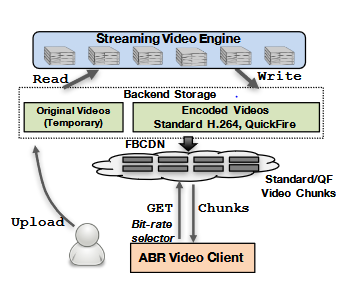
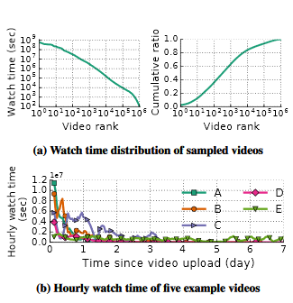

## Introduction
Facebook is one of the most popular sources on the internet for streaming video content. Up to 8 Billion video views occur daily on this site via downloading chunks of video to devices accessing the site and streaming via an Adaptive Bit Rate (ABR). ABR streaming dynamically selects the highest quality version of a video a connection can watch without pausing to buffer. Sending higher quality video requires larger amounts of data sent per chunk but gives users a better experience. When videos are uploaded to Facebook, they are encoded into multiple versions of varying qualities in order to provide each accessing user with the highest resolution video that their connection can support. If more versions are computed up front when a video is uploaded, user experience can be improved by streaming a version of the video with a closer approximation to what their device is capable of without causing buffering delays. 
Doing this extra computation for every single video uploaded to Facebook is infeasible due to the sheer volume of data being uploaded and streamed from the website on the daily basis. However, a study has shown that only 1% of videos uploaded to the site account for over 80% of all views on Facebook. If it can be figured how to predict which videos will become popular and perform extra computations for only those videos, user experience can be greatly improved with very little relative computation required by exploiting trends in video popularity. [1, 2]

## Background
The existing system begins a video upload which is then encoded and streamed to accessing users from their respective devices. Videos uploaded are encoded to H.264 codec to multiple standardized versions of quality to be used for streaming. The original file is retained for several days and can be used to generate more versions of quality or recoded. Users access the page via a media player embedded in the site that downloads media chunks in an order that can be played back without pausing. This whole video process is shown below in [1, Fig. 1].

[1, Fig. 1]

The existing method used by Facebook form video encoding is the QuickFire engine. The Quickfire engine uses 20 times the computation and generates a video with similar quality for an approximately 20% smaller size than the standard encoding. Due to the large cost by a factor of 20 when computing an upload, it is impractical to perform this computation on all videos that are uploaded to the site. If performance enhancements are only used on videos garnering large popularity, the largest positive impact on site quality can be made while requiring the fewest additional computing resources.

Suggestions to improve the performance of streaming video include: generating an “in between” version of a video e.g. if two versions of a video exist for 250 Kbps and 1 Mbps, users with connections between 500 Kbps and 1 Mbps can benefit from creating a third version of the video created to stream at 500 Kbps. And to generate more compressed versions of a video that yield similar qualities at a higher bitrate. FFmpeg’s H.264 encoding offers many preset parameters for encoding that range from veryslow to ultrafast. Using a slower encoding would generate more compressed versions but generate the same quality video. [1,4]

## Motivation for Popularity Prediction
Using popularity prediction can be largely beneficial because of the massive concentration of views centering around such a small portion of the videos uploaded to Facebook. A study was done to quantify how concentrated these views are on the site by sampling 1000 videos randomly selected on Facebook for a one-month period in 2016. The skew of Facebook’s video workload is shown below in [1, Fig. 2].

 [1, Fig. 2]
 
The video watch time vs. video rank in part (a) is several orders of magnitude in difference shown above on a log-log scale. The data shown in part (b) shows the access patterns of 5 representative videos of the patterns observed for the 25 videos just below the 10,000th most popular video. The decay of part (b) shows the need to update predictions based on changing access patterns for the time after a video is uploaded and gains popularity. [1]

## CHESS Algorithm
The method suggested to predict popularity of videos is called the CHESS (Constant History, Exponential Kernels, and Social Signals) Algorithm. CHESS is designed to be scalable by using a constant per-video state (of approx. 20GB) to handle Facebook’s video workload. It is also designed to be accurate by based on two key insights, approximations of the history of all de-identified past accesses to a video’s exponential decay of watch time and by combining constant sized time periods of historical features into a continuously updated neural network model. CHESS’s accuracy allows for the predictions of videos popularity before a video peaks in views allowing extra video computations to be done before it is too late. The CHESS algorithm goals are laid out as: to harnesses past access patterns using constant time and space, combine different features into a unified model, and efficient online training using recent access data. 
The current methods of popularity prediction use past accesses as a predictor for future behavior based on a model of self-excitation. The self-exciting behavior model bases it computation on a sum of all requests from past to infinity for a given video. The CHESS kernel improves this by simplifying the calculation using only the most recent prediction calculation and its timestamp to reduce the space and time overhead along with using the exponential decay function to model viewing popularity. The result is a prediction called the Exponentially Decayed Watch Time (EDWT). The original method used a power-law kernel to provide high accuracy results but would require all past accesses in a computation in order to determine future popularity. The EDWT prediction is less accurate per calculation but, is scalable and easier to maintain because it makes corrections via small, low cost, constant time calculations based on prior predictions. Using EDWT repeated calculations based on previous prediction calculations results in a prediction that is overall as accurate as the power-law model with much less computation cost.  
Two major inputs are provided to the neural network (NN) learning framework for the CHESS prediction method: stateless and stateful features. Stateless features are values that do not dramatically change over the life of a video (i.e. number of likes and friends of video owner, video length, age, etc.) which do not require the prediction service to keep a state associated with the value as their features can easily be obtained via query. Stateful features are the opposite, being features that can change dramatically over the life-cycle of a given video (i.e. likes and comments on a video, video shares, saves for later viewing, etc.) and the state must be saved to be associated with each prediction. The study determined that the ideal time windows for calculations were at the time windows of 1, 4, 16, and 64 hours to provide the most accurate results for prediction. [1]
## CHESS VPS
CHESS VPS (Video Prediction service) is the implementation of the CHESS algorithm providing popularity prediction for Facebook’s videos with only 8 workers distributed across 4 machines. The performance of the CHESS VPS system was assessed using various popularity predictor and the actual metrics of likes and watch time of the videos over time defined below in [1, Fig. 3] and the comparison of these metrics is displayed as Cumulative ratio of future watch time vs. Encoding length ratio in the graph in [1, Fig. 4].
 [1, Fig. 3]
 
 [1, Fig. 3]
 
The CHESS VPS provided higher accuracy than the more computation intensive SEISIMIC system which uses a power-law kernel. Along with being more accurate, the CHESS VPS was proven to reduce CPU workload by 3x for 80% of the watch time ratio. The CHESS VPS was successful in increasing accuracy over existing state of the art prediction models and used a fraction of the computing required. [1]

## Conclusion
Popularity prediction models are necessary for Facebook to deliver high quality streaming services to devices of varying connection speeds and hardware capabilities. The existing models for prediction are extremely computation intensive in order to generate the accuracy needed for capable predictions. The CHESS VPS generates a more accurate, scalable, and less taxing computation by modeling predictions on an exponential decay rather than a power-law model and using previous predictions to help drive future calculations. The system was successfully implemented and tested to show results greater than existing state-of-the-art models using only 4 machines. 

## References
L. Tang, Q. Huang, A. Puntambekar, Y. Vigfusson, W. Lloyd and K. Li, "Popularity Prediction of Facebook Videos for Higher Quality Streaming", Usenix.org, 2018. [Online]. Available: https://www.usenix.org/conference/atc17/technical-sessions/presentation/tang. 

I. Sodagar. The MPEG-DASH standard for multimedia streaming over the internet. IEEE MultiMedia, 2011.

Ip.hhi.de, 2018. [Online]. Available: http://ip.hhi.de/imagecom_G1/assets/pdfs/csvt_overview_0305.pdf.

QuickFire technology explained @Scale. https://www.facebook.com/atscaleevents/videos/1682906415315789.
