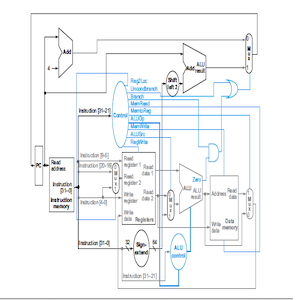

  

This is a functional single cycle (non-pipelined) processor is capable of performing basic arithmetic, logic and data operations. It is based on the ARM 64-bit architecture, with 32 registers each 64-bits wide with instruction lengths of 32-bits written in Verilog Code. 

Since the ARM CPU is little endian, the instruction memory in this project is designed to have 64 8-bits for each index. 

The Data Memory is made up of 31 64-bit values to show that the values could be accessed and stored via the CPU. 

Link to Project GitHub Page (https://github.com/agasbarro36/LEGv8-Single-Cycle).
