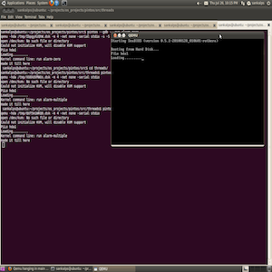

Pintos is a simple operating system framework for the 80x86 architecture. 

Pintos was created in 3 separate project components.
Project 1: User Program System Calls and interrupts were implemented in order for user programs to interface with the kernel layer.
          
Project 2:Thread scheduling and process managements was implemented to keep track of running processes and coordinate    execution
  
Project 3: Implementation of Memory Virtualization and Allocation

 
 
Link to GitHub repo: (https://github.com/agasbarro36/pintosprojD)
